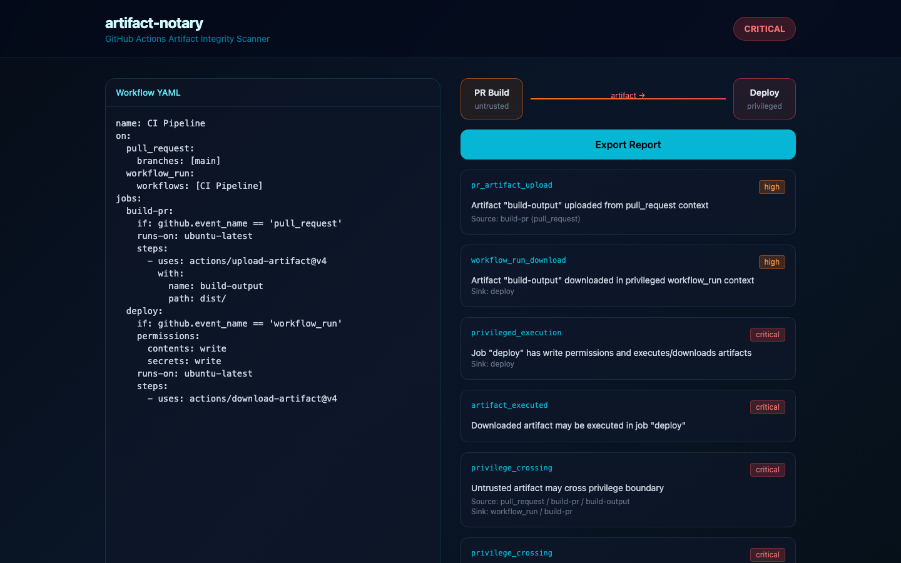

# artifact-notary

> Tracks GitHub Actions artifact chains and detects untrusted privilege boundary crossings.



## Features

- Scan `.github/workflows/*.yml`
- Detect PR-context artifact uploads consumed in `workflow_run`
- Flag secrets/write + artifact execution combos
- Pipeline visualization + Markdown report

## Quick Start

```bash
npm install
npm run dev      # http://localhost:3102
npm test
npm run cli -- fixtures/vulnerable.yml
```

## Detects

- `upload-artifact` from `pull_request` context
- `download-artifact` in `workflow_run` deploy jobs
- Artifact unzip/execute with elevated permissions

## License

MIT
